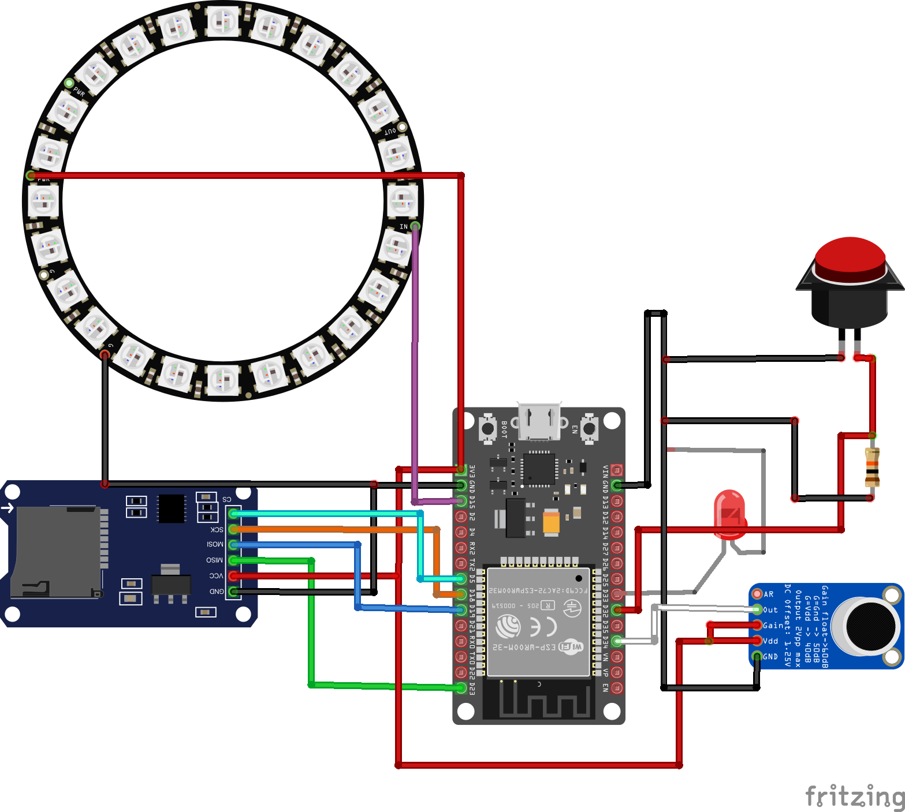

# Voice-Controlled LED Ring with the ESP32

This Arduino-based application demonstrates how to capture audio from a microphone, send it to the Gemini API for processing, and control an LED ring based on the API's response.

## Prerequisites

* Arduino IDE
* ESP32 development board
* MAX9814 Microphone module
* Push button
* LED (connected to `LED_PIN`)
* Adafruit NeoPixel ring (connected to `NEOPIXEL_PIN`)
* SD card module (connected to `SD_CS`)
* WiFi network
* [Google Gemini API key](http://aistudio.google.com/app/apikey)

## Hardware Setup

* **MAX9814 Microphone Module -> ESP32**
    * GND -> GND
    * VDD + GAIN (connected together) -> 3.3V
    * OUT -> IO34

* **SD Card Adapter -> ESP32**
    * CS -> IO5
    * SCK -> IO18
    * MOSI -> IO23
    * MISO -> IO19
    * VCC -> 3.3V
    * GND -> GND

* **Button -> ESP32**
    * One end to GND
    * One end split with 10k resistor to 3.3V and IO32

* **LED -> ESP32**
    * Connect the LED's anode (longer leg) to IO33 via a current-limiting resistor (e.g., 10k ohms).
    * Connect the LED's cathode (shorter leg) to GND.

* **Adafruit NeoPixel ring -> ESP32**
    * Connect the NeoPixel's data input pin to IO15.
    * Connect the NeoPixel's VCC pin to 5V.
    * Connect the NeoPixel's GND pin to GND.

* **ESP32 Power:** Ensure the ESP32 is powered via USB or an external 5V source.

## Software Setup

1.  Install the Arduino IDE and the ESP32 board support package.
2.  Install the following Arduino libraries:
    * WiFi
    * FS
    * SD
    * HTTPClient
    * ArduinoJson
    * Adafruit NeoPixel
3.  Load the provided code.
4.  Configure the following variables in the code:
    * `SSID`: Your WiFi network SSID.
    * `PASSWORD`: Your WiFi network password.
    * `API_KEY`: Your Google Gemini API key.
5.  Upload the code to your ESP32 board.

## Usage

1.  Power on the ESP32 board.
2.  Press the push button.
3.  Speak a sentence into the microphone.
4.  The LED will turn on while recording and turn off when finished.
5.  The application will record the audio, convert it to base64, create a JSON request, send it to the Gemini API, and process the response.
6.  The Gemini API will analyze the audio and respond with instructions to control the LEDs.
7.  The NeoPixel ring will either toggle on/off or change colors based on the spoken request.

## Functionality

* **Audio Recording:** The application records audio for a specified duration when the button is pressed and saves it as a WAV file on the SD card.
* **Base64 Encoding:** The audio data is encoded in base64 format for transmission to the Gemini API.
* **Gemini API Interaction:** The application sends a JSON request to the Gemini API with the base64 encoded audio data and instructions.
* **LED Control:** The application interprets the API's response and controls the LED and NeoPixel ring accordingly.
* **Function Calling:** The Gemini api utilizes function calling to allow for the control of the LED's.

## Code Structure

* `setup()`: Initializes the hardware, WiFi, and serial communication.
* `setupWifi()`: Connects to the WiFi network.
* `toggleLights()`: Turns the NeoPixel ring on or off while also handling color changes.
* `recordAudio()`: Records audio from the microphone and saves it to the SD card.
* `writeWavHeader()`: Writes the WAV file header.
* `base64Encode()`: Encodes binary data to base64.
* `createAudioJsonRequest()`: Creates the JSON request for the Gemini API.
* `sendAudio()`: Sends the JSON request to the Gemini API and processes the response.
* `saveAudioString()`: Saves the base64 encoded audio to the SD card.

## Notes

* Ensure that your WiFi network has internet access.
* Verify that your Gemini API key is valid.
* Adjust the `RECORD_DURATION` constant to change the recording length. Longer durations may be too much for the limited memory of the ESP32.
* Adjust the `NEOPIXEL_COUNT` constant to match the amount of neopixels you have.
* The `jsonBufferSize` may need to be adjusted depending on the length of the audio recording.
* The application uses an insecure WiFi client for simplicity. For production use, consider using a secure connection.
* The application disables brownout detection and watchdog timers. This is for testing purposes and may not be suitable for production environments.
