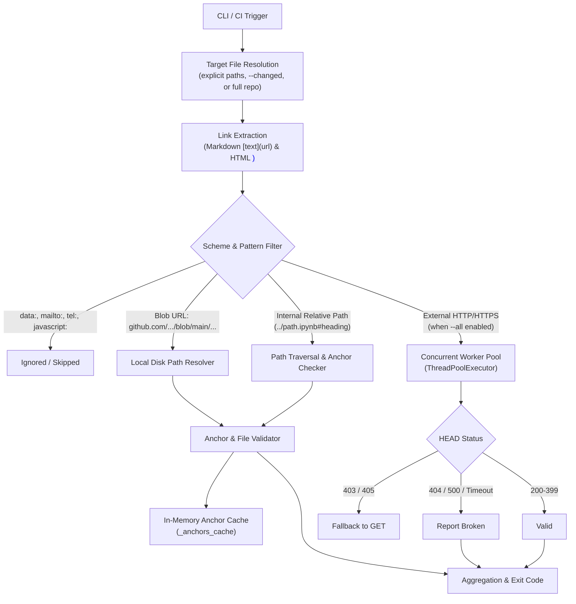

# Architecture & Design: Cookbook Link Checker (`tools/check_all_links.py`)

## 1. Overview & Objectives

The **Cookbook Link Checker** is an automated quality gate designed to prevent broken, dead, or misdirected links from entering the `google-gemini/cookbook` repository. It audits both Markdown documentation (`.md`) and Jupyter Notebooks (`.ipynb`), providing sub-second validation for Pull Requests and comprehensive health checks for scheduled maintenance.

### Primary Goals:
1. **Zero Broken Links at PR Merge**: Catch renamed notebooks, deleted files, invalid relative paths, and broken anchor links before merging.
2. **Sub-Second CI Runtime**: Ensure that PR checks on modified files execute in `<1-2s` without depending on external network calls.
3. **Deep Anchor Validation**: Validate `#anchor-name` targets both in-page and cross-file, matching GitHub's Markdown slugification rules and HTML `<a name="...">` tags.
4. **Seamless Integration**: Native Python standard library implementation with zero external dependencies (no `requests`, `beautifulsoup4`, or `curl` required).

---

## 2. Architecture & Scanning Pipeline

---

## 3. Link Categories & Resolution Rules

### 3.1 Internal Relative Links (`./...`, `../...`)
- Resolves paths relative to the parent directory of the source file.
- Guards against path traversal vulnerabilities by enforcing `target_path.relative_to(repo_root)`.
- Verifies physical file existence on disk.

### 3.2 GitHub Repository Blob URLs (`https://github.com/google-gemini/cookbook/blob/main/...`)
- Contributors often write absolute GitHub blob URLs pointing to other cookbook files.
- The tool intercepts links starting with `https://github.com/google-gemini/cookbook/blob/main/` and maps them directly to the local clone working tree.
- Catches broken links introduced during renames even if the external branch has not yet been pushed or merged.

### 3.3 Anchor Fragment Verification (`#...`)
- **Colab UI Fragments**: `#scrollTo=...` is recognized as a Google Colab cell identifier and validated against cell IDs or gracefully allowed.
- **In-Page Anchors**: `#heading-title` in `README.md` validates that `heading-title` exists as a slugified heading or HTML `<a name="...">` in `README.md`.
- **Cross-File Anchors**: `quickstarts/Get_started.ipynb#audio` validates that `quickstarts/Get_started.ipynb` exists and contains an anchor or heading slug matching `audio`.
- **Anchor Caching**: Targets are parsed once and cached in `_anchors_cache` to keep multi-thousand link audits under 2 seconds.

### 3.4 Data URIs & Media Exclusions
- Inline image data (``) is excluded via `re.compile(r"^data:")` to prevent massive base64 string dumps in error logs.
- Documentation template placeholders (`URL`, `TODO`) are whitelisted via `LINK_CHECKER_EXCLUDED_TARGETS` in `tools/config.py`.

### 3.5 External HTTP/HTTPS Links (`--all`)
- Uses `concurrent.futures.ThreadPoolExecutor(max_workers=16)` for parallel HTTP verification.
- Dispatches HTTP `HEAD` with standard browser `User-Agent`.
- Automatically retries with HTTP `GET` if the target server rejects `HEAD` with `405 Method Not Allowed` or `403 Forbidden`.
- Bypasses ignored domains (`localhost`, `127.0.0.1`, Google API endpoints requiring API keys).

---

## 4. GitHub Actions CI Integration

The workflow `.github/workflows/link_checker.yml` operates in three modes:

1. **Pull Request Mode (`pull_request`)**:
   - Computes changed files via `git merge-base HEAD ${{ github.event.pull_request.base.sha }}`.
   - Audits only modified `.ipynb` and `.md` files in `--internal-only` mode.
   - Completes in `<2` seconds, blocking regressions with zero flaky external network failures.
2. **Weekly Scheduled Health Check (`schedule: cron '0 8 * * 1'`)**:
   - Runs on Mondays at 08:00 UTC.
   - Audits all internal paths AND performs concurrent external HTTP validation across all URLs.
3. **Manual Dispatch (`workflow_dispatch`)**:
   - Enables maintainers to run full audits on demand with an optional `check_external` boolean flag.
