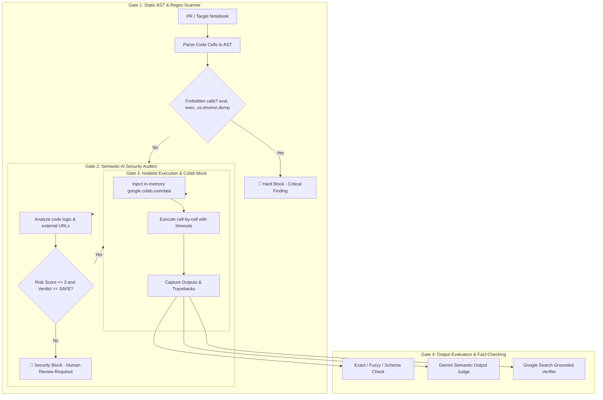

# 📐 Design Document: Notebook Automated Testing, Security & Regression Suite

## 1. Context & Objectives

The **Gemini API Cookbook** is a central public repository of Python/Jupyter tutorials. Maintaining quality across rapid model releases and SDK iterations introduces two fundamental challenges:
1. **Security in Open-Source PRs**: Untrusted pull requests from public contributors could execute arbitrary code (RCE) or exfiltrate repo secrets/tokens (`GEMINI_API_KEY`).
2. **Non-Deterministic Semantic Regressions**: Code might run without raising an exception (exit code 0), but the model's output could regress into low-quality answers, hallucinations, or broken formats.
3. **Dynamic & Evolving Data**: Grounded search queries (e.g. sports scores, weather) will naturally change over time and require factual verification rather than static string matching.

---

## 2. Threat Model & Multi-Layer Safety Defense



### Safety Guarantees:
- **No Secret Exposure in Untrusted PRs**: Automated PR checks run zero-secret static AST analysis. Live execution requires explicit maintainer gating.
- **In-Memory Mocking**: The `google.colab` mock is injected only in the kernel memory at runtime. Notebook files on disk are never altered.
- **Strict Per-Cell Timeouts**: Prevents infinite loops or stalled network requests from blocking CI pipelines.

---

## 3. Evaluation Strategies

| Strategy | Target | Evaluation Mechanism |
| :--- | :--- | :--- |
| `exact_or_fuzzy` | Deterministic outputs (token counting, math, static strings). | Normalizes whitespace and verifies exact match or bounded numeric drift (<= 35%). |
| `schema_validation` | JSON Mode, Structured Outputs, Function Calling. | Validates that output is syntactically valid JSON matching expected structure. |
| `semantic_llm` | Creative writing, reasoning, explanations, code generation. | Gemini AI Judge evaluates semantic equivalence, scoring as `MATCH`, `SLIGHT_VARIATION`, or `REGRESSION`. |
| `grounded_factual` | Real-time queries, sports scores, weather, live search. | Gemini fact-checks output against Google Search Grounding to verify freshness and accuracy. |
| `ignore_output` | Random UUIDs, timestamps, skipped interactive cells. | Marks cell as `SKIPPED` without evaluating output diffs. |

---

## 4. In-Memory Dynamic Model Overriding (`--model <name>`)

To test entire test suites or individual tutorials against candidate models (e.g. `gemini-3.7-flash`, `gemini-3.1-pro-preview`) without permanently modifying repository notebooks, `nb_tester` integrates an in-memory AST and regex transformer:

```
                      ┌─────────────────────────────────────┐
                      │   Original Notebook (.ipynb file)   │
                      │  (MODEL_ID = "gemini-2.5-flash")    │
                      └──────────────────┬──────────────────┘
                                         │ (Deepcopy in memory)
                                         ▼
                      ┌─────────────────────────────────────┐
                      │    ModelOverrideTransformer        │
                      │  - Rewrites assignments to MODEL_ID │
                      │  - Rewrites Colab @param dropdowns  │
                      │  - Generates kernel preamble        │
                      └──────────────────┬──────────────────┘
                                         │
                                         ▼
                      ┌─────────────────────────────────────┐
                      │    Ephemeral IPython Kernel         │
                      │  (MODEL_ID = "<override_model>")    │
                      │  (os.environ["MODEL_ID"] = "...")   │
                      └─────────────────────────────────────┘
```

### Safety & Integrity Guarantees:
- **Zero Disk Mutation**: All AST transformations occur exclusively on in-memory `NotebookNode` copies. Original `.ipynb` files on disk are never altered.
- **Full Assignment Coverage**: Matches single quotes, double quotes, Colab `# @param` forms, type annotations, and chained assignments.
- **Preamble Injection**: Injects `MODEL_ID` and environment variables before cell 0 to ensure immediate environment readiness.

---

## 5. Observability & Developer Experience

- **Config Centralization**: All models (`SECURITY_AUDITOR_MODEL`, `OUTPUT_JUDGE_MODEL`, `GROUNDED_VERIFIER_MODEL`, `OVERRIDE_MODEL`), timeouts, and thresholds reside in `config.py`.
- **LLM Observability**: Every single call to Gemini logs the prompt, generation parameters, response, and duration.
- **Dry-Run Capability**: Every feature can be validated using `--dry-run` without touching network or filesystem state.
